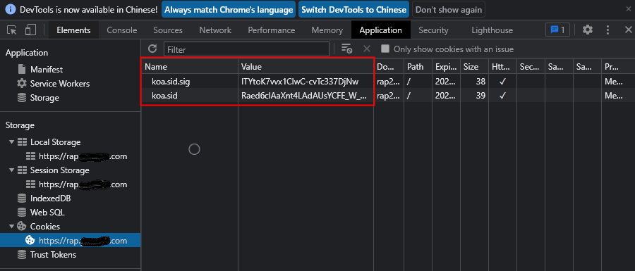
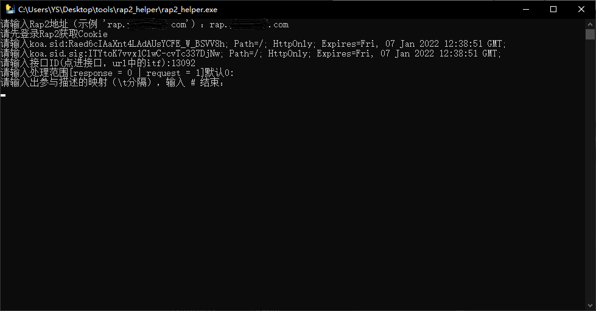

# rap2_helper 使用手册

## 序

如果你正在头疼rap2文档需要录入几十上百个字段描述，而不能批量处理，那么可以使用该脚本来完成批量描述补完。（如果你有办法可以批量导入字段描述，请踢一脚写了这个脚本的憨憨

## 操作步骤

### 一、登录rap2，记录Cookie值

​    

### 二、进入要修改的接口，记录URL中的`itf`

**在使用脚本前需要先创建好接口，脚本只负责补充描述字段**

### 三、准备字段名与描述的映射数据

格式：`字段名\t描述`

以`\t`分隔

### 四、使用脚本

有python环境的直接运行就行，没有的用exe。

**先设置一下cmd取消这个选项的勾选**

打开脚本，按照提示输入参数：

把第三步准备好的字段名与描述的映射数据贴进去，换行输入`#`结束。

## 备注

- 使用`pyinstaller`打包成exe，命令`pyinstaller -F --hidden-import 'requests' rap2_helper.py`
